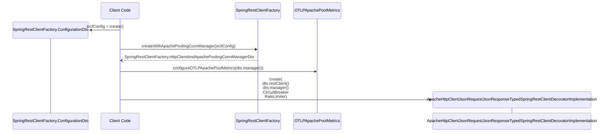

# HTTP Client software component

## Introduction

Taking the book
[Domain-Driven Design by Vaughn Vernon](https://vaughnvernon.com/)
as a starting point, then the diagram in the book on page 463, shows a HTTP
client as a facade.


## Target Architecture (structure)

But, looking at the definition of a Facade according to the book of the
[Gang of Four](https://en.wikipedia.org/wiki/Design_Patterns) (GoF):

_"Provide a unified interface to a set of interfaces in a subsystem. Facade
defines a higher-level interface that makes the subsystem easier to use."_

This unified interface, should it not be a reflection in the programming
language of choice, of the Published Language of the Open Host System of the
bounded context that the HttpClient is supposed to target?

To illustrate this:


## Creation

The target architecture, or better said, structure is clear now. But how to get
to that structure? How to create the components? And how? Or: Who does what when
and how?

The [Gang of Four](https://en.wikipedia.org/wiki/Design_Patterns) (GoF)
again to the
rescue: [The Factory pattern](https://en.wikipedia.org/wiki/Factory_method_pattern).



## How it should work

THe social desirable functionality is an http client that has a rate limiter
and circuit breaker. However, that is nice to claim that it hás it, but are
we sure those components are used the right way? What ís the right way?

## DevOps

### Logging

#### TLS


##### Handshake logging

Add to your VM arguments:

```java
-Djavax.net.debug=ssl:handshake:verbose:keymanager:trustmanager
```

##### Apache HttpClient logging (connection lifecycle)

Configure logging for these packages (example for Log4j / Logback):

org.apache.http — general client events.<br />
org.apache.http.wire — raw bytes on the wire (shows TLS-encrypted bytes, not plaintext).<br />
org.apache.http.impl.conn — connection manager events (leasing, releasing, creating).<br />

*Set levels:*

org.apache.http.impl.conn = DEBUG<br />
org.apache.http = INFO<br />
org.apache.http.wire = DEBUG (use cautiously)<br />

